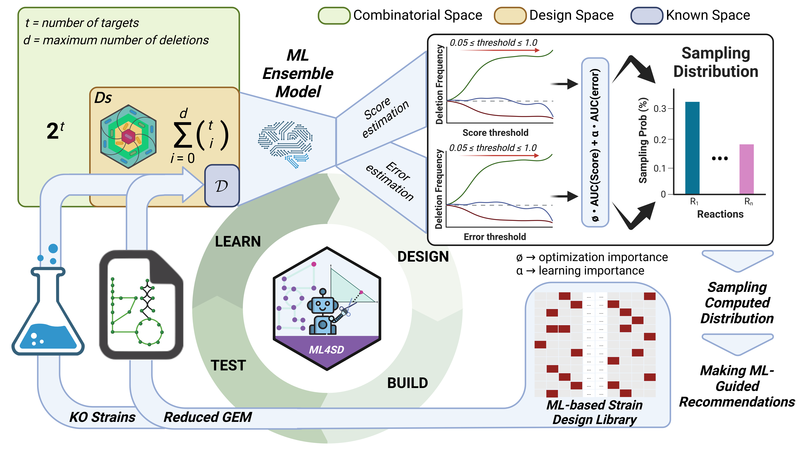

# ML4SD

A Machine-Learning approach for Strain-Design (SD) pattern recognition and recommendation.



## Description
<div align="justify">
<!---El fin último de esta aproximacion es implementar un **ciclo DBTL para la mejora de modelos de ML que predigan diseños de cepa capaces de acoplar la producción al crecimiento**, usando como conjunto de entrenamiento inicial estrategias de delección obtenidas por diferentes algoritmos de diseño. Hay que tener en cuenta que estos algoritmos generan un número variable de estrategias acopladas en un intervalo de tiempo dado, por lo que en el caso de que el conjunto no sea lo suficiente representativo como para entrenar correctamente el modelo, se irá expandiendo en cada ciclo con el fin de mejorar el modelo a **nivel de optimización y aprendizaje**.--->

The ultimate goal of this approach is to **implement a DBTL cycle for the improvement of ML models that predict strain designs capable of coupling production to growth**, using as initial training set a selection of strategies obtained by different design algorithms. It must be taken into account that these algorithms generate a variable number of coupled strategies in a given time interval, so in the case that the set is not representative enough to train the model correctly, it will be expanded in each cycle in order to improve the model **at the level of design optimisation and design space learning, using both *in silico* and experimentally obtained data**.

<!---Para ello, me inspiré en la metodología descrita en [*A machine learning Automated Recommendation Tool for synthetic biology*](https://www.nature.com/articles/s41467-020-18008-4). En primer lugar, se entrenan diferentes modelos de ML a partir de una **librería inicial generada con diferentes algoritmos de diseño**. Los diseños resultante son definidos como vectores binarios de una longitud igual al número de reacciones diferentes en el dataset inicial y que tienen un máximo de delecciones fijadas por el usuario. En esta aplicación se opta por usar el paquete ***AutoSklearn*** ([documentación](https://automl.github.io/auto-sklearn/master/index.html#)) para la generación de los modelos, ya que puede entrenar y optimizar de forma paralela diferentes modelos de ML, los cuales finalmente combina para formar un ***Ensemble Model*** que se ajusta lo mejor posible a los datos proporcionados ([artículo](https://papers.neurips.cc/paper/5872-efficient-and-robust-automated-machine-learning)).--->

To do so, I was inspired by the methodology described in [*A machine learning Automated Recommendation Tool for synthetic biology*](https://www.nature.com/articles/s41467-020-18008-4). Firstly, different ML models are trained from an **initial library generated with different design algorithms**. The resulting designs are defined as binary vectors (1 meaning that reaction is included in design) of a length equal to the number of different reactions in the initial library, including up to a maximum number of deletions set by the user. In this application, the ***AutoSklearn*** package ([documentation](https://automl.github.io/auto-sklearn/master/index.html#)) is chosen for the generation of the models, as it can train different ML models and optimise their selection in a parallel computation. The best ones are finally combined to form an ***Ensemble Model*** that better fits the provided data ([paper](https://papers.neurips.cc/paper/5872-efficient-and-robust-automated-machine-learning)).

<!---Con las predicciones generadas por el modelo, **se cuantifica la aportación individual de cada reacción al rendimiento predicho y al error**. A partir de estos valores, **se genera una distribución de muestreo** siguiendo el planteamiento utilizado en  [*Simulated Design−Build−Test−Learn Cycles for Consistent Comparison of Machine Learning Methods in Metabolic Engineering*](https://pubs.acs.org/doi/10.1021/acssynbio.3c00186). Con ella, se pueden **generar recomendaciones bien para mejorar el aprendizaje del espacio de diseño o bien para la búsqueda de diseños con rendimientos optimizados**, que se podrán validar *in silico* o mediante su implementación en el laboratiorio.--->

With the predictions generated by the model, **the individual contribution of each reaction to the predicted performance and error is quantified**. From these values, **a sampling distribution is computed** following the approach used in [*Simulated Design-Build-Test-Learn Cycles for Consistent Comparison of Machine Learning Methods in Metabolic Engineering*](https://pubs.acs.org/doi/10.1021/acssynbio.3c00186). With it, **recommendations can be suggested either to improve the learning of the design space or for guiding the search of performance-optimised designs**, that can be validated *in silico* or by implementation in the lab. 

<!---Un avance notable de esta metodología es que, **además de aprender los patrones óptimos de diseño a partir de modelos metabólicos a escala genómica (GEMs), permite integrar este conocimiento junto con datos experimentales**, corregiendo pòtenciales errores introducidos previamente. Con ello, esta metodología se puede aplicar en biofactorias para **acelerar notablemente el diseño de cepas sobreproductoras de metabolitos de interés**.--->

A key advance of this methodology is that, **in addition to learning optimal design patterns from genome-scale metabolic models (GEMs), it allows the integration of this knowledge alongside experimental data**, correcting potential errors previously introduced through *in silico* methods and curating the ML model. Consequently, this methodology can be applied in biofactories to **significantly accelerate the design of strains that overproduce metabolites of interest**.

</div>

## Getting Started

### Dependencies

* For assuring a clean install all python-related dependencies are collected in [environment.yml](https://github.com/extrevaro/ML4SD/blob/master/environment.yml)
* This repository was developed in and intended for linux-based operative systems.
* The testing of the code was performed using python 3.9.7
* [Slurm Workload Manager](https://slurm.schedmd.com/) is needed for training large models through [TrainGeneralistModel.py](https://github.com/extrevaro/ML4SD/TrainGeneralistModel.py)
* For SD algorithm-specific requirements (e.g Matlab needed for gcfront), please visit their respective pages.

### Installing

1. Clone this repo:

```Bash
gh repo clone extrevaro/ML4SD
```

2. Go to the project directory and create conda environment from [environment.yml](https://github.com/extrevaro/ML4SD/blob/master/environment.yml):

```Bash
cd ~/ML4SD
conda env create -f environment.yml
```

3. Replace the original package files of *Auto-Sklearn* and *PySwarms* for the ons in [edited_packages folder](https://github.com/extrevaro/ML4SD/tree/master/edited_packages):

```Bash
cp edited_packages/autosklearn/backend.py <path_to_autosklearn_within_conda_environment>/automl_common/common/utils/backend.py
cp edited_packages/pyswarms/base_discrete.py <path_to_pyswarms_within_conda_environment>/base/base_discrete.py
cp edited_packages/pyswarms/binary.py <path_to_pyswarms_within_conda_environment>/discrete/binary.py
```

### Executing program

#### Train Bioprocess-Specific ML models

1. Generate a library of designs with a SD algorithm and create a folder with them and the GEM needed to compute them. Note that the directory name should follow the pattern **<Sustrate_ID>\_<Product_ID>\_<Project_tag>**. 

2. Go to [TrainSpecialistModels.py](https://github.com/extrevaro/ML4SD/blob/master/TrainSpecialistModels.py) and edit the following lines with the provided indications:

```Python
#TrainSpecialistModels.py file
10  project_list = [(s_1, p_1), ..., (s_n, p_n)] 		#List of tuples containing Sustrate-Product pairs of bioprecesses
11
12  C = 1 							#DBTL Cycle number
13  target_var = 'yield' 					#Score of the design by its column name in library file
14  train_time = 120*60 					#Training time in seconds
15  
16  strain_design_algorithm = "gcswarms"			#Selected SD algorithm. Either "gcswarms" or "gcfront"
17  project_tag = 'chemical_space_ko_results'
18  root_project_dir = 'examples/PSO4SD'		#Relative path to data parent directory
19  library_filename = 'gcSwarm_binary_design_library.csv'	#Library file name
```

**IMPORTANT. The library should be a *.csv* file with the following structure:**

| Reaction1\_ID | ... | ReactionN\_ID | target\_var |
|---------------|-----|---------------|-------------|
|       1       | ... |       0       |    0.234    |
|       0       | ... |       1       |    0.686    |

3. Execute the python script in the shell:

```Bash
python ~/ML4SD/TrainSpecialistModels.py
```

This will generate a number of Bioprocess-Specific ML models equal to the number of bioprocesses you provide. 

#### Train Chassis-Specific ML models
<div align="justify">

To generate a Chassis-Specific model you previously need to generate SD data for several bioprocesses guided by the same GEM. Then you have to merge all of them in a single *.csv* file with the same structure described above. An example of how this can be done is in [merge_bioprocess_data.py](https://github.com/extrevaro/ML4SD/blob/master/utils/merge_bioprocess_data.py). Once you have this file, run the *train_generalist_replicates.sh* script as follows:

</div>

```Bash
bash ~/ML4SD/train_generalist_replicates.sh -d <path_to_library> -r <number_of_replicates>
```

<div align="justify">

This scripts calls several *sbatch* with the same allocated resources. The training time, memory limit and number of jobs for training a Chassis-Specific ML model are already optimized but can be changed within [TrainGeneralistModel.py](https://github.com/extrevaro/ML4SD/blob/master/TrainGeneralistModel.py) by tuning the values of variables *'train_time'*, *'memory_limit'* and *'n_jobs'* respectively.

</div>

#### DBTL cycle for Strain-Design using ML models
<div align="justify">


    
To generate the computational framework for implementing a DBTL cycle, we have chosen the **jupyter notebook platform**, as it displays a **user-friendly** interface while maintaining the **capability of directly editing relevant variables** affecting the workflow. In our case, those variables are parameters affecting:  

</div>

* The strain-design algorithm (gcSwarms)
* The active-learning algorithm
* The redirection of workflow output.

<div align="justify">
    
Merging active-learning algorithms with a DBTL cycle methodology allows for an effective search of the design space, based on knowledge gained in previous experiments. Consequently, the **initial library can be relatively small**, as long as it contains designs with a **sufficient range of score values to learn**. Moreover, the small size of the initial library is also desirable to reduce costs during the test phase in a wet lab setup.

Once you select the initial library size, you have to **select the initial training time for the ensemble model** following the methodology you prefer, you have an example in [training_time.csv](https://github.com/extrevaro/ML4SD/examples/PSO4SD/EX_4hbz_e_EX_6ax_c_chemical_space_ko_results/training_time.csv). As the training data increase with the number of cycles, **we dynamically update the training time each cycle, maintaining the same data to time ratio** during the DBTL.

Concerning the number of recommendations to make on each cycle, we took guidance from the previously mentioned paper [*Simulated Design-Build-Test-Learn Cycles for Consistent Comparison of Machine Learning Methods in Metabolic Engineering*](https://pubs.acs.org/doi/10.1021/acssynbio.3c00186). In this study, a **comparation of the predictive power of a ML model is made across different DBTL cycle strategy scenarios**. Along all the tested scenarios, no significant differences could be observed. However, the **incremental strategy is the one reaching the maximum predictive power within the minimum number of cycles**, so we decided to adopt it in our workflow when run in explorative mode. **For the explotative mode we leave the user to choose the number of recommendations to make** in each cycle.

**The parameter determining the DBTL mode is the learning importance (α)** being explorative mode for α>0.5 and exploitative in any other case. In addition, α also determines importance of each deletion feature during the computation of the ML-based sampling distribution. **The selection of this parameter is left for the user** as there is no clear guidance for setting it. In our [examples](https://github.com/extrevaro/ML4SD/examples), we adopted a value of 1 for the two first cycles and a value of 0 for the last cycles. As a recommendation, **a common practise in the field is to set α to 1 in the first cycle and gradually diminish it unil it reaches to 0**.

Taking into account the previous suggestions, the only thing you need to start improving your strain design pipeline is to **choose a microbial chasis with an available GEM, a bioprocess of interest and execute the notebook** [ML4SD_DBTL.ipynb](https://github.com/extrevaro/ML4SD/blob/master/ML4SD_DBTL.ipynb). 

</div>


## Authors

Contributors names and contact info:

* **Author.** Alvaro Gargantilla Becerra
  - **Public Profiles.** [ResearchGate](https://www.researchgate.net/profile/Alvaro-Gargantilla-Becerra); [GoogleScholar](https://scholar.google.com/citations?user=GoRjUL0AAAAJ&hl=en)
  - **Affiliations.** [Spanish National Centre for Biotechnology](http://www.cnb.csic.es/index.php/en); [Systems Biotechnology Group](https://systemsbiotechgroup.com)

## License

This project is licensed under the [??] License - see the LICENSE.md file for details

